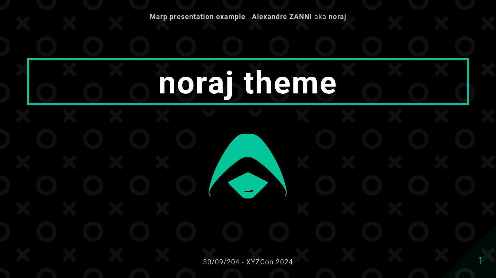

# Cybertopia theme for Marp

> A dark theme for [Marp](https://marp.app/) / [Marpit](https://marpit.marp.app/) slides ecosystem using the [Cybertopia Saturated](https://github.com/noraj/cybertopia-highlightjs) highlight.js theme.

🗒️|📷
---|---
Example of title page with image|
Example of text|
Example of code block|

## Installation

After the installation is complete, your slide frontmatter should at least contain this:

```md
---
marp: true
theme: cybertopia
class: invert
---
```

### For VS Code / Code OSS / VSCodium

1. You already have [Marp for VS Code](https://github.com/marp-team/marp-vscode) installed.
2. Open VS Code settings (<kbd>CTRL</kbd> + <kbd>,</kbd>).
3. Search `markdown.marp.themes` and clikc `Add element`.
4. Add this link: https://raw.githubusercontent.com/noraj/cybertopia-marp/master/themes/cybertopia.css.

Alternatively, you can also edit `.vscode/settings.json` on a per project basis, and add this if the theme was copied locally…

```json
{
    "markdown.marp.themes": [
        "./themes/cybertopia.css"
    ]
}
```

… or this if you want to fetch the theme remotly:

```json
{
    "markdown.marp.themes": [
        "https://raw.githubusercontent.com/noraj/cybertopia-marp/master/themes/cybertopia.css"
    ]
}
```

### For Marp CLI

To use the theme with [Marp CLI](https://github.com/marp-team/marp-cli):

1. Either clone the repository somewhere `https://github.com/noraj/cybertopia-marp.git` or download a [Github ZIP archive](https://github.com/noraj/cybertopia-marp/archive/master.zip) and uncompress it.
2. Copy `themes/cybertopia.css` file to your marp project.
3. When using the Marp CLI, you may have to specify the theme you are using with the `--theme cybertopia.css` option.

For example, on this repository:

- Live rendering: `marp ./slides.md -s -I ./`
- Generate HTML: `marp ./slides.md --theme-set ./themes -o index.html`
- Generate PDF: `marp ./slides.md --theme-set ./themes --pdf --allow-local-files`

## Demo

Demo slideshow: https://noraj.github.io/cybertopia-marp/